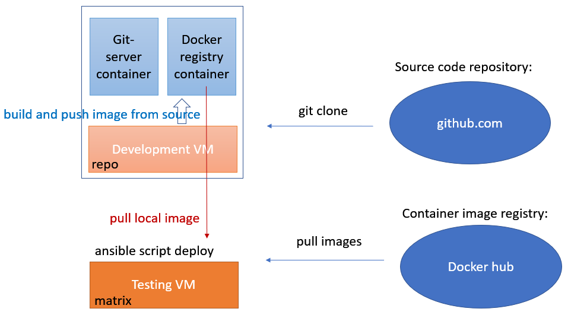

# Matrix server deploy with self build Element-Web

This instruction describes how to run Matrix server with custom Element-Web client.

[Matrix](https://matrix.org/faq/) - Matrix is an open standard for interoperable, decentralized, real-time communication over IP.

[Element-Web](https://github.com/vector-im/element-web) - A glossy Matrix collaboration client for the web.





## TL;DR

### On `repo` development server

Clone Element-web source code:
```bash
userrepo@repo:~$ git clone https://github.com/vector-im/element-web.git
```


*Change the code.*

Build new docker image (tag 0.1):
```bash
userrepo@repo:~/element-web$ docker build -t repo:5000/myelement:0.1 .
```


Upload created image to local registry:
```bash
userrepo@repo:~$ docker push repo:5000/myelement:0.1
```


### On `matrix` test server

Execute ansible script for automatic build and deploy:
```bash
root@matrix:~# ansible-playbook -i inventory/hosts setup.yml --tags=setup-all,start
```


# Prepare local docker registry and git server

## Configure local registry server

OS name:
```bash
userrepo@repo:~$ uname -a
Linux repo 5.10.0-10-amd64 #1 SMP Debian 5.10.84-1 (2021-12-08) x86_64 GNU/Linux
```


Configure network interface static IP and DNS:
```bash
root@repo:~# cat /etc/network/interfaces
source /etc/network/interfaces.d/*

# The loopback network interface
auto lo ens192
iface lo inet loopback

# The primary network interface
allow-hotplug ens192
iface ens192 inet static
        address 10.99.20.15/24
        gateway 10.99.20.1
        # dns-* options are implemented by the resolvconf package, if installed
        dns-nameservers 10.130.2.5 10.99.2.5
        dns-search <local domain-name>
```


Restart network service:
```bash
root@repo:~# service networking restart
```


### Add domain name to DNS (Ubuntu server)
```bash
ubuntu@ubuntu1:~$ sudo vim /etc/bind/zones/db.<domain>
;matrix
repo            IN      A   10.99.20.15
matrix          IN      A   10.99.20.10

ubuntu@ubuntu1:~$ sudo named-checkzone <domain> /etc/bind/zones/db.<domain>
zone <domain>/IN: loaded serial 3

ubuntu@ubuntu1:~$ sudo systemctl restart bind9
```


### Clone Element-Web source code from `github` to local PC (repo):
```bash
userrepo@repo:~$ git clone https://github.com/vector-im/element-web.git
userrepo@repo:~$ cd element-web
```


Change description name and version:
```bash
userrepo@repo:~$ vim ./package.json

"name": "myelement",
"version": "0.1",
```


Build docker image from local source (the command contains dot "." in the end!):
```bash
userrepo@repo:~/element-web$ docker build -t myelement:0.1 .

...

Successfully built 4cb907421bac
Successfully tagged myelement:0.1
```


Check built images:
```bash
userrepo@repo:~/element-web$ docker images
REPOSITORY   TAG         IMAGE ID       CREATED         SIZE
myelement    0.1         4cb907421bac   8 minutes ago   64.7MB
<none>       <none>      1241e4f357b7   8 minutes ago   2.74GB
node         14-buster   f23b8d5c0bb6   8 days ago      913MB
nginx        alpine      cc44224bfe20   3 weeks ago     23.5MB
```


Run local image for testing:
```bash
userrepo@repo:~$ docker run -p 80:80 myelement:0.1
```

Now you could open local IP url in a browser to check running element-web.


## Run local registry
Reference: [Docker blog](https://www.docker.com/blog/how-to-use-your-own-registry/)


### Start local registry from `dockerhub` image
```bash
userrepo@repo:~$ docker run -d -p 5000:5000 --restart=always --name registry registry:2
Unable to find image 'registry:2' locally
2: Pulling from library/registry
...
Status: Downloaded newer image for registry:2
342b07a5402845a2edc8d7405ffb291348c6ba4a85fc60630d95d94ab2c6001d

userrepo@repo:~$ docker images
REPOSITORY   TAG         IMAGE ID       CREATED        SIZE
myelement    0.1         4cb907421bac   4 days ago     64.7MB
<none>       <none>      1241e4f357b7   4 days ago     2.74GB
node         14-buster   f23b8d5c0bb6   12 days ago    913MB
nginx        alpine      cc44224bfe20   3 weeks ago    23.5MB
registry     2           b8604a3fe854   2 months ago   26.2MB

userrepo@repo:~$ docker ps
CONTAINER ID   IMAGE        COMMAND                  CREATED          STATUS          PORTS
NAMES
342b07a54028   registry:2   "/entrypoint.sh /etc…"   16 seconds ago   Up 15 seconds   0.0.0.0:5000->5000/tcp, :::5000->5000/tcp
registry
```


### Add new local tag to the image
```bash
userrepo@repo:~$ docker tag myelement:0.1 repo:5000/myelement:0.1
userrepo@repo:~$ docker images
REPOSITORY                 TAG         IMAGE ID       CREATED        SIZE
myelement                  0.1         4cb907421bac   4 days ago     64.7MB
repo:5000/myelement        0.1         4cb907421bac   4 days ago     64.7MB
<none>                     <none>      1241e4f357b7   4 days ago     2.74GB
node                       14-buster   f23b8d5c0bb6   12 days ago    913MB
nginx                      alpine      cc44224bfe20   3 weeks ago    23.5MB
registry                   2           b8604a3fe854   2 months ago   26.2MB
```


### Upload image to local registry
```bash
userrepo@repo:~$ docker push repo:5000/myelement:0.1
```


### Remove image from local file system
```bash
userrepo@repo:~$ docker image remove myelement:0.1

userrepo@repo:~$ docker images
REPOSITORY   TAG         IMAGE ID       CREATED        SIZE
<none>       <none>      1241e4f357b7   4 days ago     2.74GB
node         14-buster   f23b8d5c0bb6   12 days ago    913MB
nginx        alpine      cc44224bfe20   3 weeks ago    23.5MB
registry     2           b8604a3fe854   2 months ago   26.2MB
```


## Checking pull image from local registry

Add security exception for local registry for testing purpose only:
```bash
# cat /etc/docker/daemon.json             
{                                                      
        "insecure-registries": ["repo:5000"] 
}

# systemctl restart docker.service
```


### Pull image test
```bash
userrepo@repo:~$ docker pull repo:5000/myelement:0.1
0.1: Pulling from myelement
...
Status: Downloaded newer image for repo:5000/myelement:0.1
repo:5000/myelement:0.1

userrepo@repo:~$ docker images
REPOSITORY                 TAG         IMAGE ID       CREATED        SIZE
repo:5000/myelement        0.1         4cb907421bac   4 days ago     64.7MB
<none>                     <none>      1241e4f357b7   4 days ago     2.74GB
node                       14-buster   f23b8d5c0bb6   12 days ago    913MB
nginx                      alpine      cc44224bfe20   3 weeks ago    23.5MB
registry                   2           b8604a3fe854   2 months ago   26.2MB
```


## Configuring matrix server

### Network interface config
```bash
root@matrix:~# uname -a
Linux matrix 5.10.0-9-amd64 #1 SMP Debian 5.10.70-1 (2021-09-30) x86_64 GNU/Linux

vim /etc/network/interfaces
source /etc/network/interfaces.d/*                                                     
                                                                                       
# The loopback network interface                                                       
auto lo ens192 ens224                                                                  
iface lo inet loopback                                                                 
                                                                                       
# The primary network interface                                                        
allow-hotplug ens192                                                                   
iface ens192 inet static                                                               
        address <public ip/mask>                                                      
        gateway <public gw ip>                                                         
        # dns-* options are implemented by the resolvconf package, if installed        
        dns-nameservers 1.1.1.1                                                 
        dns-search <public domain name>                                                     
                                                                                       
allow-hotplug ens224                                                                   
iface ens224 inet static                                                               
        address 10.99.20.10/24                                                         
        up route add -net 10.0.0.0/8 gw 10.99.20.1                                     
        dns-nameservers 10.130.2.5                                                     
```


### Resolving configuration
```bash
$ vim /etc/resolvconf/resolv.conf.d/head
nameserver 10.130.2.5
nameserver 1.1.1.1

systemctl restart resolvconf.service
systemctl restart systemd-resolved.service
systemctl restart networking.service

cat /etc/resolv.conf
nameserver 10.130.2.5
nameserver 1.1.1.1
nameserver 127.0.0.53
search <public domain> <local domain>
```


### Checking image pull from local registry `repo`

If you have this error you need to create SSL certificates for local registry:
```bash
root@matrix:~# docker pull repo:5000/myelement:0.1
Error response from daemon: Get "https://repo:5000/v2/": http: server gave HTTP response to HTTPS client
```


Using not secure `http` is a bad idea. We add this exception for local server for testing purpose:
```bash
root@matrix:~# cat /etc/docker/daemon.json             
{                                                      
        "insecure-registries": ["repo:5000"] 
}                                                      
```


Restart docker service:
```bash
root@matrix:~# systemctl restart docker.service
root@matrix:~# systemctl status docker.service
```


### Test image pull from local `repo` server
```bash
root@matrix:~# docker pull repo:5000/myelement:0.1
0.1: Pulling from myelement
...
Status: Downloaded newer image for repo:5000/myelement:0.1
repo:5000/myelement:0.1

root@matrix:~# docker images
REPOSITORY                          TAG               IMAGE ID       CREATED         SIZE
repo:5000/myelement       0.1               4cb907421bac   4 days ago      64.7MB

# docker image remove repo:5000/myelement:0.1
```


## Configuring ansible script to use self build image

Reference: [matrix-docker-ansible-deploy](https://github.com/spantaleev/matrix-docker-ansible-deploy)

```bash
root@matrix:~# vim ./matrix-docker-ansible-deploy/roles/matrix-client-element/defaults/main.yml

matrix_client_element_container_image_self_build: true
matrix_client_element_container_image_self_build_repo: "ssh://repo/git-server/repos/element-web.git"

matrix_client_element_version: 0.1
matrix_client_element_docker_image: "{{ matrix_client_element_docker_image_name_prefix }}myelement:{{ matrix_client_element_version }}"
matrix_client_element_docker_image_name_prefix: "repo:5000/"
```


## Configuring local git server (repo)
Reference: [git-server-docker](https://hub.docker.com/r/jkarlos/git-server-docker/)

```bash
userrepo@repo:~$ docker pull jkarlos/git-server-docker
```


Prepare ssh config:
```bash
userrepo@repo:~$ cat .ssh/config
Host repo
    Hostname 10.99.20.15
    User git
    Port 2222
    IdentityFile ~/.ssh/repo
```


### Generate and copy ssh user keys
```bash
$ ssh-keygen
$ cp ~/.ssh/repo.pub ~/keys
```


### Start local git server from docker image
```bash
$ docker run -d -p 2222:22 -v ~/keys:/git-server/keys -v ~/repos:/git-server/repos jkarlos/git-server-docker
```


### Upload git repository
```bash
userrepo@repo:~$ git clone https://github.com/vector-im/element-web.git
userrepo@repo:~$ git clone --bare element-web element-web.git
userrepo@repo:~$ mv element-web.git ~/repos
userrepo@repo:~$ docker restart <container-id>
```


### Test to clone source code from local repo
```bash
$ git clone ssh://repo/git-server/repos/element-web.git
```
